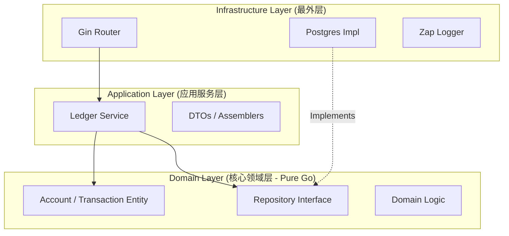

# 🏗 FinScale Backend Architecture Design

| 文档信息 | 内容 |
| :--- | :--- |
| **项目** | FinScale (Financial Scalable Core) |
| **模块** | **Core Ledger (Titan)** |
| **架构风格** | Modular Monolith + DDD + Clean Architecture |
| **语言** | Go (Golang) |
| **版本** | v1.0.0 |
| **最后更新** | 2025-12-13 |

---

## 1. 架构概览 (Architecture Overview)

FinScale 的后端架构设计遵循 **"关注点分离" (Separation of Concerns)** 原则。我们将系统划分为不同的层级，核心业务逻辑（Domain）独立于外部框架（Web/DB）。

### 1.1 核心架构模式
*   **Modular Monolith (模块化单体)**:
    *   代码在物理上是一个单体应用（One Binary），但在逻辑上严格按业务域（`ledger`, `payment`, `auth`）隔离。
    *   **规则**: 模块之间严禁直接调用数据库，必须通过 `Interface` 进行通信。
*   **Clean Architecture (整洁架构)**:
    *   **依赖规则**: 依赖关系只能由外向内。**Domain 层不依赖任何东西**，Infrastructure 层依赖 Domain 层。

### 1.2 分层图示 (Layering Strategy)



---

## 2. 详细分层设计 (Layer Details)

### 2.1 领域层 (Domain Layer) - `internal/ledger/domain`
这是系统的**心脏**，包含所有的业务逻辑和规则。它**不依赖**任何框架（Gin, GORM, Viper）。

*   **Entities (实体)**: 对应数据库表，但包含业务行为。
    *   `Account`: 包含 `CheckBalance`, `Debit`, `Credit` 方法。
    *   `Transaction`: 包含 `ValidateEntries` 方法。
*   **Value Objects (值对象)**:
    *   `Money`: 基于 `decimal` 的封装，处理精度运算。
    *   `Currency`: 货币代码验证。
*   **Repository Interfaces (仓储接口)**:
    *   定义了“我们以此方式存取数据”，但不关心具体怎么存（SQL还是Redis）。
    *   e.g., `type AccountRepository interface { FindByCode(...) ... }`

### 2.2 应用层 (Application Layer) - `internal/ledger/service`
这是系统的**大脑**，负责编排业务流程。

*   **职责**:
    *   控制数据库事务 (Transaction Script)。
    *   调用 Domain 层的逻辑。
    *   DTO (Data Transfer Object) 转换。
*   **示例逻辑**:
    ```go
    func (s *LedgerService) PostTransaction(req PostTxRequest) error {
        // 1. Start DB Transaction
        // 2. Load Accounts
        // 3. Call Domain Logic (account.Debit/Credit)
        // 4. Save Changes
        // 5. Commit
    }
    ```

### 2.3 接口层 (Interface/Port Layer) - `internal/ledger/api`
这是系统的**大门**，负责与外部世界交互。

*   **Technology**: Gin Framework.
*   **职责**:
    *   解析 HTTP 请求 (Bind JSON)。
    *   参数校验 (Validator)。
    *   调用 Application Service。
    *   返回统一格式的 JSON 响应。

### 2.4 基础设施层 (Infrastructure Layer) - `internal/platform`
这是系统的**基座**，提供技术支持。

*   **Database**: PostgreSQL 驱动，实现 Domain 层的 Repository 接口。
*   **Config**: Viper 配置加载。
*   **Logging**: Zap 日志封装。

---

## 3. 关键技术选型与决策 (Tech Stack & Decisions)

| 组件 | 选型 | 理由 (Decision Record) |
| :--- | :--- | :--- |
| **Language** | **Go 1.21+** | 高并发、强类型、适合云原生。 |
| **Web Framework** | **Gin** | 生态最成熟，性能极高，适合 API Gateway。 |
| **Database** | **PostgreSQL** | 最佳开源关系型数据库，支持 JSONB 和强 ACID。 |
| **ORM/SQL** | **GORM** (慎用) | 为了开发效率MVP阶段使用 GORM，但核心记账逻辑**必须**Review SQL 执行计划。未来可能迁移到 sqlx。 |
| **Decimal** | **shopspring/decimal** | **关键决策**：严禁使用 float64。所有金额运算必须用此库。 |
| **Config** | **Viper** | 支持环境变量覆盖 (12-Factor App)，方便 Docker 部署。 |
| **DI** | **Google Wire** | 依赖注入代码生成工具，避免 main.go 里写一堆手动初始化代码。 |
| **Logging** | **Uber Zap** | 结构化日志 (JSON)，高性能，方便接入 ELK。 |

---

## 4. 核心流程设计 (Core Flows)

### 4.1 记账流程 (The Posting Flow)

这是系统中最核心、最复杂的流程。

1.  **API**: 接收 `POST /transactions`，校验 JSON 格式。
2.  **Service**:
    *   开启数据库事务 `tx`.
    *   **幂等检查**: 查询 `reference_id` 是否存在。
    *   **锁账户**: 根据 `account_code` 排序后（**防止死锁**），执行 `SELECT FOR UPDATE` 或加载当前 `version`。
3.  **Domain**:
    *   校验借贷平衡 (`Sum(Dr) == Sum(Cr)`).
    *   校验账户状态 (是否冻结).
    *   校验余额是否足够 (如果是借记且不允许透支).
    *   计算新余额。
4.  **Repo**:
    *   插入 `ledger.transactions` Header。
    *   插入 `ledger.postings` Lines.
    *   更新 `ledger.accounts` 余额 (使用 CAS: `UPDATE ... WHERE version = old_version`).
5.  **Service**: 提交事务 `tx.Commit()`.

---

## 5. 项目目录结构映射 (Code Structure)

```text
finscale/
├── backend/
│   ├── cmd/api/main.go           # 程序入口 (DI Container, Router Setup)
│   │
│   ├── internal/
│   │   ├── platform/             # 基础设施 (DB, Logger, ErrorCode)
│   │   │   ├── database/         # GORM 封装
│   │   │   └── logger/           # Zap 封装
│   │   │
│   │   └── ledger/               # === 核心模块 ===
│   │       ├── api/              # [HTTP Layer] Handlers, DTOs
│   │       ├── service/          # [App Layer] Transaction Script
│   │       ├── domain/           # [Domain Layer] Entities, Repo Interfaces (Pure Go)
│   │       │   ├── account.go
│   │       │   ├── transaction.go
│   │       │   └── valobj.go     # Value Objects (Money, Currency)
│   │       └── adapter/          # [Infra Layer] Repo Implementations
│   │           └── repo/         # PostgreSQL Implementation
│   │
│   └── configs/                  # 配置文件模板
│       └── config.yaml
```

---

## 6. 错误处理策略 (Error Handling Strategy)

不返回模糊的 "500 Internal Server Error"，而是定义清晰的业务错误码。

*   **E_VALIDATION (400)**: 参数错误 (e.g., 金额为负).
*   **E_IDEMPOTENCY (409)**: 重复请求.
*   **E_CONCURRENT (409)**: 乐观锁冲突 (需要重试).
*   **E_BALANCE_MISMATCH (422)**: 借贷不平.
*   **E_INSUFFICIENT_FUNDS (422)**: 余额不足.

---

### 📝 架构师备注 (Architect's Notes)

1.  **关于 ORM 的使用**:
    在金融核心中，ORM 是一把双刃剑。在 `internal/ledger/adapter/repo` 层实现时，我们要格外小心。对于高频的余额更新操作，建议直接手写 SQL 或使用 GORM 的 `Exec` 方法，确保 `WHERE version = ?` 的逻辑准确无误。

2.  **关于浮点数**:
    在 Review 代码时，如果看到任何 `float32` 或 `float64` 出现在 `domain` 包中，直接 **Reject**。必须全链路使用 `decimal.Decimal`。

3.  **关于依赖注入**:
    我们将使用 `Wire` 来管理依赖。这看起来有点繁琐，但当系统扩展到 50 个 Service 时，你会感谢这个决定的。

---
