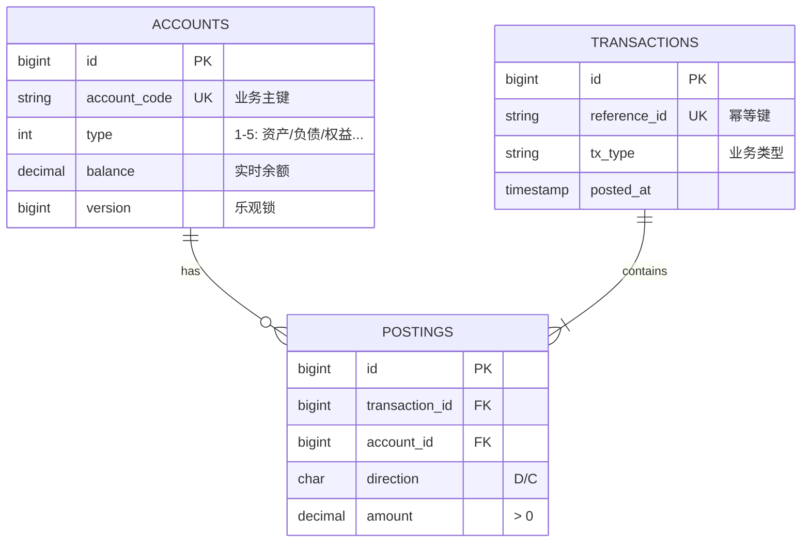

---

# 📘 FinScale Database Design: Core Ledger

| 文档信息 | 内容 |
| :--- | :--- |
| **项目** | FinScale (Financial Scalable Core) |
| **模块** | **Ledger (核心总账)** |
| **数据库** | PostgreSQL 15+ |
| **Schema** | `ledger` (独立模式隔离) |
| **版本** | v1.3.0 (Final Architecture) |
| **负责人** | FinScale Architect |
| **最后更新** | 2025-12-13 |

---

## 1. 设计哲学 (Design Philosophy)

本系统的数据库设计遵循 **"Immutable Core, Flexible Edge" (内核不可变，边缘灵活)** 的原则：

1.  **Schema Isolation (模式隔离)**：
    *   所有总账相关表均置于 `ledger` schema 下，而非 `public`。
    *   **目的**：实现模块化单体架构 (Modular Monolith)，为未来拆分微服务预留“逃生舱”。
2.  **Hybrid Constraints (混合约束策略)**：
    *   **物理定律 (Physical Laws)**：对于金融世界中亘古不变的规则（如借贷方向、账户类型），使用数据库 `CHECK` 约束严防死守。
    *   **业务规则 (Business Rules)**：对于随市场变化的规则（如交易类型、币种），在数据库层保持灵活（字符串存储），逻辑校验上移至代码层。
3.  **Auditability (可审计性)**：
    *   总账系统是 **Append-Only (仅追加)** 的。严禁物理删除或修改已入账的分录。

---

## 2. 实体关系图 (ER Diagram)



---

## 3. 表结构详解 (Table Definitions)

### 3.1 科目表 `ledger.accounts`
**用途**：存储系统当前的“状态” (State)。

| 字段名 | 类型 | 约束 | 说明 |
| :--- | :--- | :--- | :--- |
| `id` | BIGSERIAL | PK | 内部主键 |
| `account_code` | VARCHAR(32) | UNIQUE | 业务主键 (e.g., "1001", "2001-01") |
| `name` | VARCHAR(100) | NOT NULL | 科目名称 |
| `type` | SMALLINT | **CHECK (1-5)** | **核心约束**：1:资产, 2:负债, 3:权益, 4:收入, 5:费用。金融公理，不可变。 |
| `currency` | CHAR(3) | DEFAULT 'CNY' | **灵活设计**：使用 ISO 代码。不加 Check 约束以支持未来新币种。 |
| `balance` | DECIMAL(20,4)| NOT NULL | **高精度**：杜绝浮点数误差。实时余额。 |
| `version` | BIGINT | DEFAULT 1 | **并发控制**：乐观锁版本号。 |
| `status` | SMALLINT | **CHECK (1,0,-1)**| 1:正常, 0:冻结, -1:销户。 |

**关键决策**：
*   为什么 `type` 是数字？—— 参与高频核心记账逻辑计算，数字比较比字符串快。
*   为什么 `currency` 是字符串？—— 方便阅读日志，且无需 Join 字典表。

### 3.2 交易主表 `ledger.transactions`
**用途**：存储业务发生的上下文 (Context)。

| 字段名 | 类型 | 约束 | 说明 |
| :--- | :--- | :--- | :--- |
| `id` | BIGSERIAL | PK | 内部主键 |
| `reference_id`| VARCHAR(64) | UNIQUE | **幂等性键**：防止外部系统重试导致重复扣款。 |
| `tx_type` | VARCHAR(32) | NOT NULL | **灵活设计**：如 "DEPOSIT", "FEE"。不设约束，适应业务快速迭代。 |
| `description` | TEXT | | 交易摘要 |
| `posted_at` | TIMESTAMPTZ | NOT NULL | 记账时间 |
| `metadata` | JSONB | | 扩展字段 (操作员、地理位置、关联订单等) |

**关键决策**：
*   为什么 `tx_type` 不加 Check 约束？—— 业务类型是发散的（今天有红包，明天有理财），不应为了业务配置变更而去锁底层大表。

### 3.3 分录表 `ledger.postings`
**用途**：存储资金流动的原子操作 (Atomic Lines)。

| 字段名 | 类型 | 约束 | 说明 |
| :--- | :--- | :--- | :--- |
| `id` | BIGSERIAL | PK | |
| `transaction_id`| BIGINT | FK | 关联交易主表 |
| `account_id` | BIGINT | FK | 关联科目表 |
| `direction` | CHAR(1) | **CHECK ('D','C')**| **核心约束**：只有借(D)/贷(C)。复式记账铁律。 |
| `amount` | DECIMAL(20,4)| **CHECK (> 0)** | **防御性编程**：金额必须为正。禁止“借-100”这种模糊语义。 |
| `exchange_rate` | DECIMAL(10,6)| DEFAULT 1.0 | 交易发生时的汇率快照 |

---

## 4. 并发与一致性策略 (Concurrency Strategy)

### 4.1 乐观锁 (Optimistic Locking)
针对热点账户（如系统代付户），为了避免数据库死锁，采用 CAS (Compare-And-Swap) 机制。

**SQL 实现逻辑**:
```sql
UPDATE ledger.accounts 
SET balance = balance + :amount, 
    version = version + 1 
WHERE id = :account_id 
  AND version = :current_version; -- 关键点
```
如果 `Affected Rows == 0`，说明在读取和写入之间余额被他人修改，应用层需重试。

### 4.2 强一致性事务
*   `Transaction Header` 插入
*   `Postings` 插入
*   `Accounts` 余额更新
以上三步必须包裹在同一个数据库 `BEGIN ... COMMIT` 事务中。

---

## 5. 预置数据 (Bootstrapping)

系统初始化时，将构建一个“平衡”的账本（创世区块）：

1.  **资产端**：建立 `1001-金库现金`。
2.  **权益端**：建立 `3001-实收资本`。
3.  **创世交易**：借记现金 100万，贷记资本 100万。
    *   此时：资产 (100万) = 负债 (0) + 权益 (100万)。
    *   系统处于完美的会计平衡状态。

---

### 📝 架构师备注 (Architect's Notes)

> "Constraints are the last line of defense, not the first."
> (约束是最后一道防线，而不是第一道。)

我们在数据库层加 `CHECK` 约束（如 `amount > 0`），是为了防止代码中的 Bug 污染核心数据。一旦脏数据进入总账，清洗成本将是天文数字。因此，虽然我们在 Go 代码层会有校验逻辑，但数据库层的“物理定律”约束绝不能省。