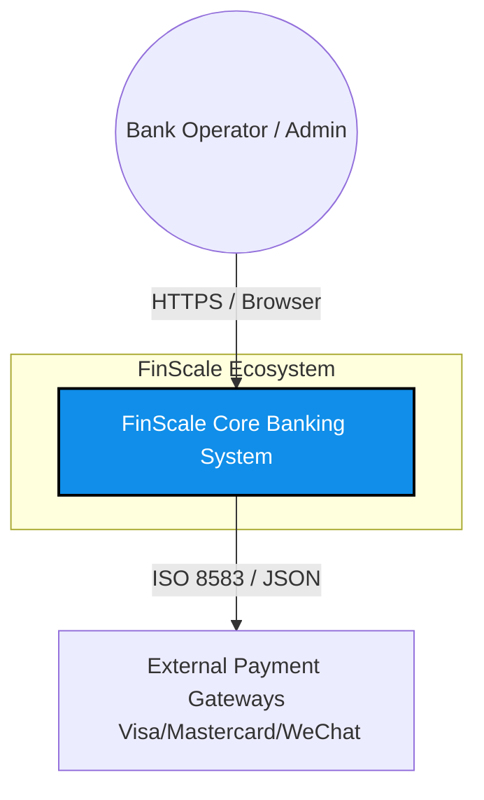
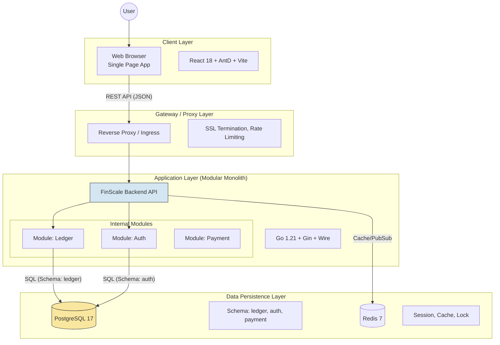

---

# 🏛️ FinScale System Architecture Overview

| 文档信息 | 内容 |
| :--- | :--- |
| **项目** | FinScale (Financial Scalable Core) |
| **视角** | **System Context & Container View (C4 Model)** |
| **架构风格** | Modular Monolith (Cloud-Native Ready) |
| **版本** | v1.0.0 |
| **最后更新** | 2025-12-13 |

---

## 1. 架构愿景 (Architecture Vision)

FinScale 旨在构建一套**“可运行在笔记本上的银行核心”**。
我们采用 **模块化单体 (Modular Monolith)** 策略，在开发阶段享受单体应用的极简部署与强一致性，同时通过严格的模块边界（Schema Isolation, Domain Driven Design）保留未来向微服务平滑演进的能力。

---

## 2. C4 架构视图 (C4 Model)

### 2.1 Level 1: System Context (系统上下文)
**视角**：FinScale 在金融生态中的位置。

### 2.2 Level 2: Container Architecture (容器架构)
**视角**：系统的运行单元与技术选型。这是**最重要的架构图**。

---

## 3. 技术全景图 (Technology Stack)

| 层次 (Layer) | 技术选型 (Stack) | 核心职责 (Responsibility) |
| :--- | :--- | :--- |
| **Frontend** | React 18, TypeScript, Ant Design 5, Vite, React Query | 提供专业的银行柜员操作界面，确保数据展示精度。 |
| **Backend** | **Go (Golang)**, Gin, Wire, Zap, Viper | 处理高并发业务逻辑，编排事务，暴露 RESTful API。 |
| **Core Logic** | **shopspring/decimal**, Clean Arch, DDD | 保证资金计算零误差，业务逻辑纯净无依赖。 |
| **Database** | **PostgreSQL 15** (Schema Isolation) | ACID 事务存储，JSONB 扩展，行级锁并发控制。 |
| **Cache** | Redis 7 | 幂等性 Key 存储，分布式锁，热点数据缓存。 |
| **DevOps** | Docker, Docker Compose, Makefile | 实现“一键启动”，环境一致性交付。 |

---

## 4. 关键架构决策 (Key Architecture Decisions)

### 4.1 为什么是“模块化单体”而不是“微服务”？
*   **现状**：单兵作战，无需处理分布式事务（Saga/TCC）带来的巨大复杂性。
*   **优势**：数据库事务（ACID）是处理“总账平衡”最安全、最高效的手段。
*   **未来**：通过 Go 的 `internal` 包机制和 Postgres 的 `Schema` 隔离，我们在物理上是单体，逻辑上已解耦。

### 4.2 资金安全设计 (Safety Design)
1.  **双重校验**：前端校验（用户体验） + 后端 Domain 校验（业务逻辑） + 数据库 Check 约束（物理底线）。
2.  **不可变账本**：所有 `Postings` 表仅支持 `INSERT`，严禁 `UPDATE/DELETE`。
3.  **并发防御**：全链路采用**乐观锁 (Optimistic Locking)** 机制，在高并发下宁可拒绝请求也不覆盖数据。

---

## 5. 部署拓扑 (Deployment Topology)

### 5.1 本地开发环境 (Local Dev)
*   **工具**: Docker Compose
*   **结构**: 
    *   `finscale-backend` (Hot Reload)
    *   `finscale-frontend` (Vite Dev Server)
    *   `postgres`
    *   `redis`

### 5.2 生产环境 (Production Ready)
*   **容器化**: 构建极小的 Alpine/Distroless 镜像。
*   **编排**: 可部署至 Kubernetes (K8s) 或 AWS ECS。
*   **网络**: 
    *   Postgres 部署在私有子网 (Private Subnet)，严禁公网访问。
    *   所有对外服务通过 Nginx/Ingress 暴露。

---

## 6. 流量与数据流向 (Data Flow)

**场景：柜员提交一笔存款 (Deposit)**

1.  **Browser**: 柜员点击“提交”，React 发送 `POST /api/v1/ledger/transactions` (带 Bearer Token)。
2.  **Gateway**: Nginx 终结 SSL，转发给 Backend。
3.  **Backend (Middleware)**: 
    *   解析 Token，验证权限。
    *   检查 Redis 中的 `Idempotency-Key`，防止重放。
4.  **Backend (Service)**: 
    *   开启 SQL 事务 `BEGIN`。
    *   调用 `ledger` 模块逻辑。
5.  **Database**: 
    *   `INSERT INTO transactions`
    *   `INSERT INTO postings`
    *   `UPDATE accounts SET balance... WHERE version...`
    *   触发 `CHECK` 约束（如余额变负则报错）。
6.  **Backend**: `COMMIT` 事务。
7.  **Browser**: 收到 `200 OK`，弹出“存款成功”凭证。

---
